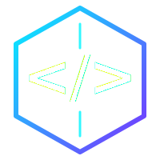

# Nguyễn Danh Huy — IT Engineer & DevOps Portfolio

[](https://huyzpka-commits.github.io/ITpro/)
[](https://developer.mozilla.org/en-US/docs/Web/HTML)
[](https://developer.mozilla.org/en-US/docs/Web/CSS)
[](https://developer.mozilla.org/en-US/docs/Web/JavaScript)

> Portfolio cá nhân của **Nguyễn Danh Huy** — IT Engineer & DevOps Specialist với đam mê xây dựng hệ thống, kiểm thử phần mềm và tối ưu hóa hạ tầng công nghệ.

---

## 🌐 Live Demo

Truy cập trực tiếp: **https://huyzpka-commits.github.io/ITpro/**

---

## 🚀 Giới thiệu

Đây là website portfolio cá nhân được thiết kế theo phong cách **Cyber Tech / Dark Mode** hiện đại, nhằm giới thiệu:

- Kinh nghiệm làm việc trong lĩnh vực IT, DevOps, Full-stack Development và QA Testing.
- Các kỹ năng chuyên sâu: Docker, Kubernetes, CI/CD, Cloud, Windows, Office, SEO, Automation.
- Các dự án cá nhân/tiêu biểu đã thực hiện.
- Thông tin liên hệ để hợp tác và tuyển dụng.

---

## ✨ Tính năng nổi bật

- **Giao diện Cyber Tech** — Dark theme, particle animation, terminal window, scanline overlay.
- **Hiệu ứng tương tác** — Typing effect, animated skill bars, counter stats, hover glow, smooth scroll.
- **Responsive Design** — Tương thích desktop, tablet và mobile.
- **Tối ưu hiệu suất** — Chỉ sử dụng HTML/CSS/JavaScript thuần, tải nhanh, không cần framework.
- **Logo SVG tùy chỉnh** — Biểu tượng `</>` trong hexagon với hiệu ứng glow.

---

## 🛠️ Công nghệ sử dụng

- **HTML5** — Cấu trúc semantic, SEO-friendly.
- **CSS3** — Flexbox, Grid, animations, custom properties, backdrop-filter.
- **JavaScript (ES6+)** — Particle canvas, typing effect, intersection observer, DOM interactions.
- **Google Fonts** — Orbitron, JetBrains Mono, Be Vietnam Pro, Inter.

---

## 📂 Cấu trúc project

```
portfolio/
├── index.html          # Trang chính
├── style.css           # Toàn bộ styles
├── script.js           # JavaScript xử lý tương tác
├── logo.svg            # Logo SVG
├── avatar.jpg          # Ảnh đại diện
└── README.md           # File này
```

---

## 📌 Các dự án tiêu biểu

| Dự án | Mô tả | Công nghệ |
|-------|-------|-----------|
| **BlockAds** | Ứng dụng chặn quảng cáo Android & Chrome | Android, Chrome Extension MV3, DNS |
| **Smart Search Engine** | Công cụ tìm kiếm nâng cao | Elasticsearch, Python, React |
| **DevOps Dashboard** | Dashboard giám sát hệ thống real-time | Grafana, Prometheus, Docker |
| **Auto Test Framework** | Framework kiểm thử tự động | Selenium, Python, Jenkins |
| **Windows Optimizer Toolkit** | Bộ công cụ tối ưu Windows | PowerShell, C#, WinAPI |
| **Office Automation Suite** | Tự động hóa Excel/Word | VBA, Python, Office 365 API |

---

## 🚀 Cách chạy project

### 1. Clone repository

```bash
git clone https://github.com/huyzpka-commits/ITpro.git
```

### 2. Mở file HTML

```bash
cd ITpro
# Mở bằng trình duyệt mặc định
start index.html
```

Hoặc sử dụng VS Code với extension **Live Server** để xem trực tiếp.

---

## 📬 Liên hệ

- **Email:** [huyzhcs@gmail.com](mailto:huyzhcs@gmail.com)
- **Telegram:** [@danhhuynguyen0110](https://t.me/danhhuynguyen0110)
- **GitHub:** [github.com/huyzpka](https://github.com/huyzpka)
- **Facebook:** [fb.com/nguyendanhhuy0110](https://www.facebook.com/nguyendanhhuy0110/)
- **Địa điểm:** Việt Nam 🇻🇳

---

## 📄 License

Project này được chia sẻ công khai để tham khảo và học tập. Vui lòng không sao chép cho mục đích thương mại mà không có sự đồng ý.

---

<p align="center">
  
  <br>
  <strong>Built with passion by Nguyễn Danh Huy</strong>
</p>
